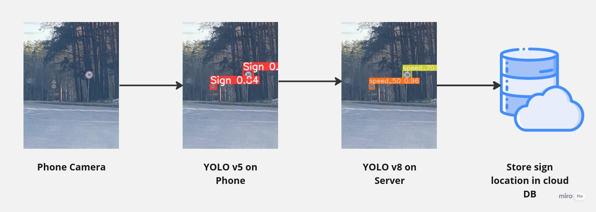

# 🚗 Co-Driver

This project provides a solution to assist drivers using a mobile app by notifying them of:

- 🚦 Traffic lights
- 🛑 Speed bumps
- 📡 Radars

It also alerts the driver if they exceed the **safe distance** from other vehicles.

The system leverages **real-time data analysis, advanced algorithms, and machine learning** techniques to provide accurate notifications, helping drivers plan their routes efficiently.

---

## 🔍 Detection Process

We implemented a **Multi-Level Classification** technique to identify road objects such as:

- 🚗 **Vehicles**
- 🚥 **Traffic lights**
- 🛑 **Speed bumps**

This ensures **optimal performance** on mobile devices by using minimal resources while delivering accurate results.

We fine-tuned both **YOLO v5** and **YOLO v8** models to meet our specific needs. The **on-device model** detects road signs and vehicles, sending the data to our **server** for additional analysis. Once processed, the results are stored in our **database**.

Additionally, we developed a **Sudden Actions Detection Model** to identify abrupt driving behaviors.

---

## 📊 Data Gathering

We manually acquired data from multiple sources using **Bash scripts** to:

- 📥 Download datasets
- 🔄 Filter and modify labels to align with our standards

Our **sudden actions detection model** successfully identified abrupt movements but struggled with routine activities. To enhance accuracy, we built an auxiliary application to collect and format **gyroscope and accelerometer data** under normal driving conditions. This enriched dataset was then merged with the existing dataset to improve training.

---

## 🎥 Promo Video

📺 Watch the project in action:

---

## 🚘 Project Functionalities

### ✅ 1. Notify the driver about upcoming speed bumps, radars, and traffic lights

- Helps drivers slow down and adjust their speed accordingly.

### ✅ 2. Speed Limit Alerts

- Notifies drivers when they exceed the speed limit to encourage safe driving habits.

### ✅ 3. Safe Distance Monitoring

- Warns drivers when they get too close to other vehicles, reducing collision risks.

### ✅ 4. Dangerous Overtaking Warning

- Alerts drivers when they attempt risky overtaking maneuvers.

### ✅ 5. Driving Summary Report

- Provides insights into driving behavior, including:
  - 📊 Average speed
  - 📍 Distance traveled
  - 🚦 Traffic violations
  - 🔄 Driving efficiency

### ✅ 6. Stored Geolocation of Road Signs

- Sign locations are recorded via:
  - **Admin Input** (Manual addition)
  - **Automated Detection** (Using ML models)
  - **User Reports** (Crowdsourced data)
  - 📌 **Ranking System** (Admin = 10x user weight)

### ✅ 7. Voice Interaction (Speech-to-Text & Text-to-Speech)

- **Hands-Free Interaction:** Users can respond to app prompts via voice commands.
- **Text-to-Speech Alerts:** Notifies users about new events, updates, or messages.

---

📄 **[Explore project documentation](https://drive.google.com/drive/folders/18tbl1xp42fTL5SsjR5C84BLNQi3Q02gm)**
